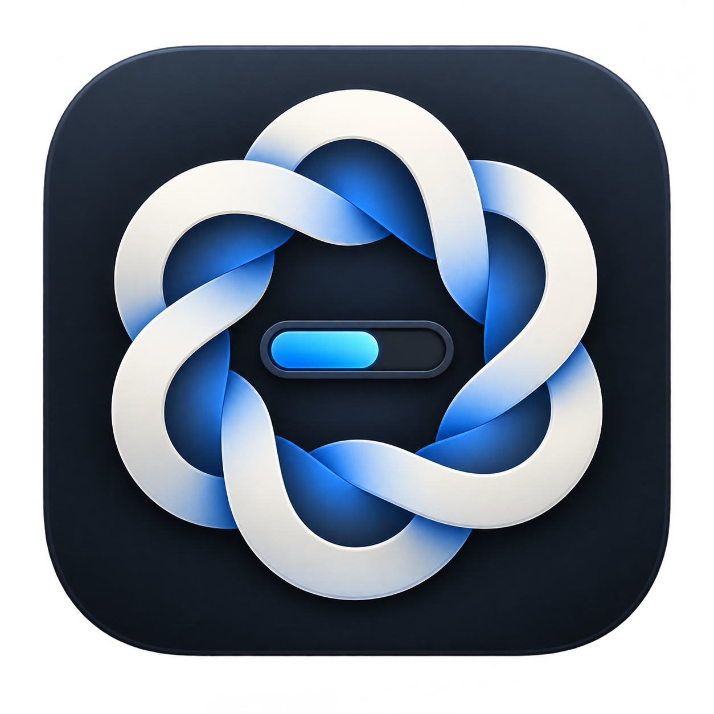
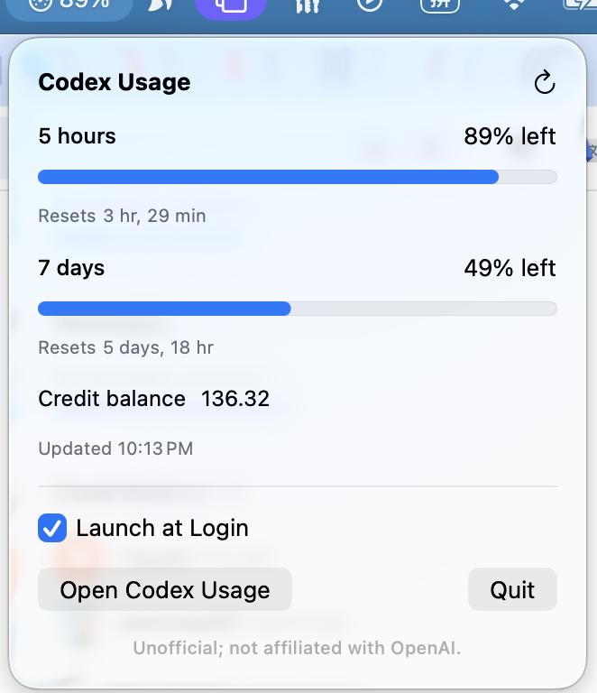

<div align="center">



# Codex Usage

**Your Codex CLI usage, always one glance away.**

A tiny macOS menu-bar app that shows your remaining 5-hour and 7-day [Codex CLI](https://github.com/openai/codex) usage, reset times, and credit balance — no window, no Dock icon, no fuss.

[](#requirements)
[](#requirements)
[](LICENSE)

<sub>🍎 macOS only — this is a native menu-bar app and does not run on Windows or Linux.</sub>



</div>

## Why

Codex CLI's usage limits reset on rolling windows, and it's easy to burn through a session without realizing you're close to the wall. Codex Usage sits quietly in your menu bar and answers one question at a glance: *how much do I have left?*

- **5-hour window** — percentage remaining and exact reset time
- **7-day window** — percentage remaining and exact reset time
- **Credit balance** — pulled straight from your Codex account
- **Launch at Login** — one toggle, no extra setup

No Dock icon, no window to manage — it lives in the menu bar and polls the local Codex CLI every 30 seconds.

> Unofficial and not affiliated with OpenAI.

## Requirements

- **macOS 14 (Sonoma) or later, Apple Silicon (arm64)** — this is a native Mac menu-bar app; it does not support Windows, Linux, or Intel Macs.
- [Swift](https://www.swift.org/install/) toolchain (Xcode or Command Line Tools)
- [Codex CLI](https://github.com/openai/codex) installed and authenticated (`codex login`)

## Install

Clone and run the build script, which compiles the app, stages it into a `.app` bundle, installs it to `/Applications`, and launches it:

```bash
git clone https://github.com/kelvinlee97/codex-usage-menubar.git
cd codex-usage-menubar
./script/build_and_run.sh
```

The installed bundle remains `/Applications/Codex Balance.app` for upgrade and Launch-at-Login compatibility, while Finder and the menu bar show the product name **Codex Usage**.

The app appears in your menu bar showing your remaining usage percentage. Click it to open the popover with full details, a link to the Codex usage page, and a Launch at Login toggle.

## Build from source

```bash
swift build
```

This compiles the executable without bundling it into a `.app` — useful for quick iteration or CI. Release build:

```bash
CODEX_BALANCE_CONFIGURATION=release ./script/build_and_run.sh
```

## Other build script modes

```bash
./script/build_and_run.sh --verify     # launch and confirm the process is running
./script/build_and_run.sh --logs       # launch and stream all app logs
./script/build_and_run.sh --telemetry  # launch and stream only this app's logs
./script/build_and_run.sh --debug      # launch under lldb
```

## Testing

There's no XCTest target; a self-check harness covers parsing, percentage math, executable resolution, and pipe handling:

```bash
CODEX_BALANCE_SELF_CHECK=1 swift run CodexBalance
```

Run the full local QA gate (release build, self-check, bundle/icon/signature checks, launch, and a live usage refresh) before shipping a change:

```bash
./script/qa.sh
```

## Packaging a release

```bash
DEVELOPER_ID_APPLICATION="Developer ID Application: Your Name (TEAMID)" \
NOTARY_PROFILE="codex-usage-notary" \
./script/package_release.sh
```

Public release packaging requires both variables and fails immediately if either is missing. It signs, notarizes, staples, rebuilds, and verifies `dist/CodexUsage.zip`.

## How it works

Codex Usage locates the Codex CLI on your machine, launches `codex app-server --stdio`, and talks to it over stdin/stdout to read your account's rate-limit and credit-balance data. This is not a public/stable API — it's the same interface the Codex CLI itself uses locally, so it may change between Codex CLI releases.

## Known limitations

See [handoff.md](handoff.md) for the full list, including:

- macOS + Apple Silicon (`arm64`) only — no Windows/Linux/Intel support.
- The menu-bar glyph uses a built-in monochrome SF Symbol.
- Not sandboxed; App Store distribution is unproven for this architecture.

## License

[MIT](LICENSE)
